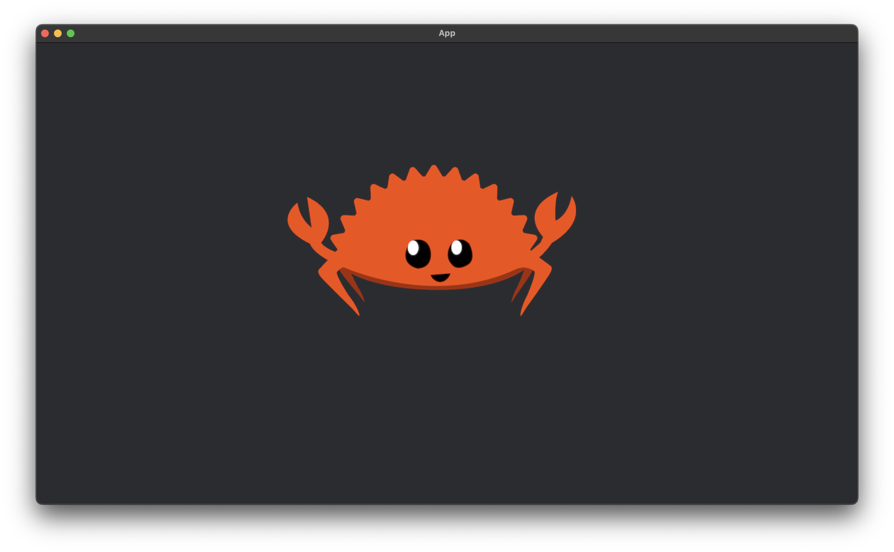

# bevy-tutorial

Rust 製ゲームエンジン [bevy](https://bevyengine.org/) を適当に遊び倒してみます.



```shell
cargo run -p <tutorial-dir-name>
```

----

[assets: rustacean-flat-happy.png](assets/rustacean-flat-happy.png) is **[CC0 1.0 Universal](https://creativecommons.org/publicdomain/zero/1.0/)** licensed.

See also: [rustacean.net](https://rustacean.net/)
